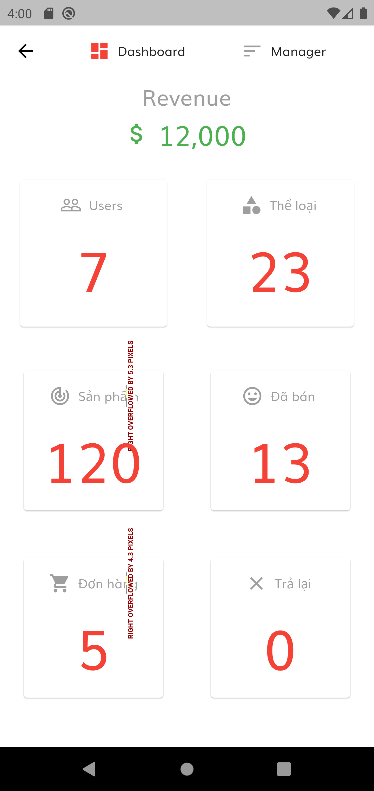
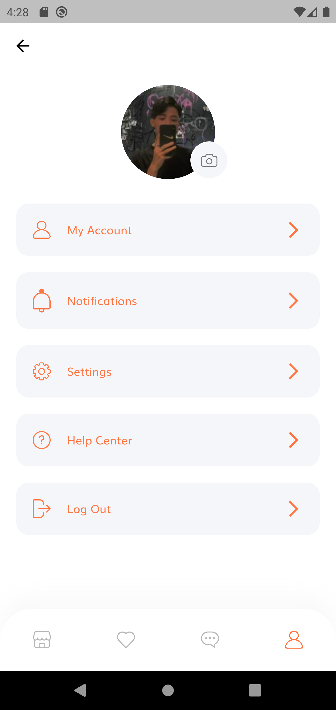
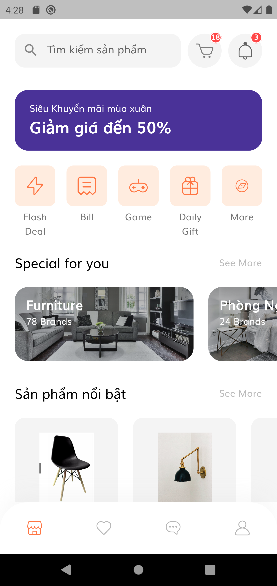
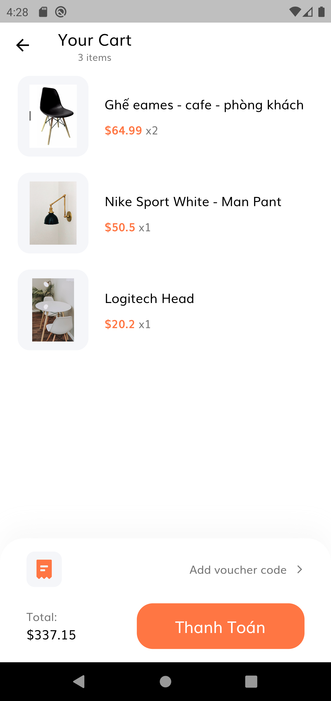
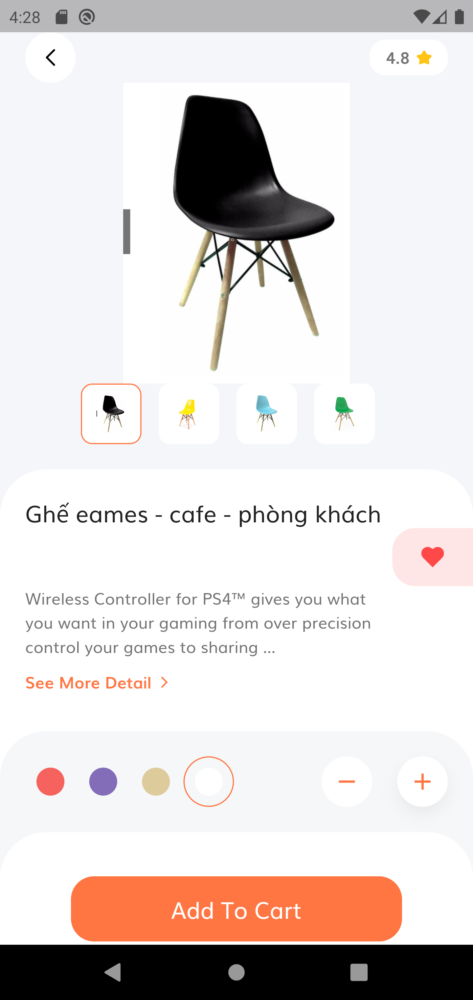

# Hệ thống quản lý và bán đồ nội thất

login: 
     * account: admin@gmail.com
     * password: admin1234
    
    
##📖Description
   * Môn học: Lập trình ứng dụng cho các thiết bị di động - Nhóm 2
   * Họ và tên: Hoàng Ngọc Thành
   * MSV: 18T1021285
  
  
##⭐Getting Started
 * Project này chỉ mới là UI 
 * sẽ phát triển dần để hoàn thiện hệ thống

##📚 Package using
 * cupertino_icons: ^1.0.4
 * flutter_svg: ^0.22.0
 * provider: ^6.0.0
 * rolling_switch: ^0.0.2
 * firebase_auth: ^3.3.4
 * firebase_core: ^1.10.6
 * fluttertoast: ^8.0.8
 * cloud_firestore: ^3.1.5

## Feature implement
 * Authentication (Login/Logout, Register)
 * HomePage (List all product, filter),
 * Product details (Show product details),
 * Add to Cart (Cart Page),
 * Shipping method (UI),
 * Confirm Orders (UI),
 * Change Credit Card Payment (UI),
 * Profile (UI),
 * Admin panel(UI)

## Android Screenshots

<table>
  <tr>
    <td>Home Screen</td>
    <td>Product Details</td>
    <td>Product cart</td>
  </tr>
  <tr>
    <td valign="top"></td>
    <td valing="top"></td>
    <td valing="top"></td>
  </tr>
  <tr>
    <td valign="top"></td>
    <td valing="top"></td>
    <td valing="top"></td>
  </tr>
  <tr>
      <td valign="top"></td>
      <td valign="top"></td>
      <td valign="top"></td>
  </tr>
  <tr>
      <td valign="top"></td>
      <td valign="top"></td>
  </tr>
 </table>
 
  
 

 ## Directory Structure
 
  📦 Lib\
├───📂components
├───📂constants
├───📂helper
├───📂model
├───📂screens
│   ├───📂admin
│   │   └───📂admin_sign_in
│   │       └───📂components
│   ├───📂forgot_password
│   │   └───📂components
│   ├───📂login_success
│   │   └───📂components
│   ├───📂sign_in
│   │   └───📂components
│   ├───📂sign_up
│   │   └───📂components
│   └───📂users
│       ├───📂cart
│       │   └───📂components
│       ├───📂complete_profile
│       │   └───📂components
│       ├───📂details
│       │   └───📂components
│       ├───📂home
│       │   └───📂components
│       ├───📂otp
│       │   └───📂components
│       ├───📂profile
│       │   └───📂components
│       └───📂splash
│           └───📂components
└───📂services

 ## 💬 Feedback
  email: thanhhoangit76@gmail.com 
  facebook: https://www.facebook.com/thanh.hoangg.0607
